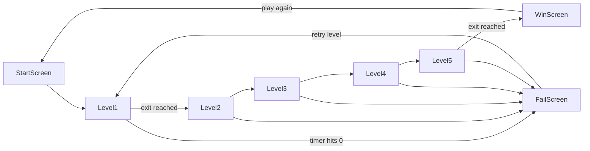

# Snail Maze Game Plan

## Recommendation

Use a **top-down grid maze** with **HTML + Canvas + vanilla JavaScript**. This is the best fit for entrance/exit maze gameplay, works with your chosen stack (no build step required), and keeps scope manageable for a first playable version.



## Project Setup

Create a new project at `~/Projects/snail-maze/` with this structure:

```
snail-maze/
├── index.html          # canvas + UI overlay
├── css/
│   └── style.css       # layout, HUD, screens
└── js/
    ├── main.js         # boot, screen routing
    ├── game.js         # core loop, state machine
    ├── maze.js         # level data + rendering
    ├── player.js       # snail movement + collision
    ├── obstacles.js    # obstacle types + behavior
    ├── timer.js        # 3-minute countdown
    └── ui.js           # HUD, win/lose screens
```

Initialize git, open in Cursor, and serve locally with any static server (e.g. `python -m http.server 8080`) for testing.

## Core Gameplay Loop

Each level runs this loop at ~60fps via `requestAnimationFrame`:

1. Read keyboard input (arrow keys or WASD)
2. Update snail position (smooth movement, grid-aligned collision)
3. Update dynamic obstacles (moving hazards, gates)
4. Check collisions (walls, obstacles, exit)
5. Decrement timer
6. Draw maze, obstacles, snail, HUD
7. Transition on win (exit reached), lose (timer = 0), or quit

**Controls:** Arrow keys / WASD to move. Optional: hold Shift for a slow "snail crawl" feel (slightly slower max speed).

**Snail feel:** Smooth pixel movement with a gentle bobbing animation and a slime trail (optional polish) to sell the snail theme.

## Maze Design (5 Levels)

Use **hand-authored level maps** stored as 2D tile arrays in [`js/maze.js`](js/maze.js). This gives predictable difficulty curves; procedural generation can be a later enhancement.

Each level is a grid (e.g. 20x15 tiles, 32px per tile). Tile types:

| Tile | Meaning |
|------|---------|
| `#` | Wall |
| `.` | Open path |
| `S` | Start (entrance) |
| `E` | Exit |
| `M` | Mud (slows snail 50%) |
| `W` | Water puddle (instant fail or -10s penalty — recommend instant fail for tension) |
| `K` | Key (required to pass gate) |
| `G` | Gate (blocks until key collected) |
| `R` | Rock (pushable obstacle, levels 4–5) |

**Level progression:**

| Level | Theme | New mechanic | Maze complexity |
|-------|-------|--------------|-----------------|
| 1 | Garden path | Mud patches only | Simple, few branches |
| 2 | Rainy garden | Water puddles (avoid) | More dead ends |
| 3 | Locked gate | Collect key, then reach exit | Longer route |
| 4 | Rocky trail | Pushable rocks to clear paths | Narrow corridors |
| 5 | Final gauntlet | Mud + water + key + rocks + 1 moving hazard | Largest maze |

Each level gets the **full 3-minute timer** (timer resets on level start, not carried over).

## Obstacle System

Implement in [`js/obstacles.js`](js/obstacles.js) as a small class hierarchy or config-driven handlers:

- **Mud** — passive tile; reduces snail speed while overlapping
- **Water** — passive tile; triggers level fail (or respawn at start with -15s — pick one; recommend fail for clarity)
- **Gate** — blocks path until `player.hasKey === true`
- **Rock** — pushable when snail walks into it; blocked if rock would hit a wall
- **Moving hazard** (level 5 only) — patrols between two waypoints on a timer; touching it fails the level

Collision uses **AABB (axis-aligned bounding box)** against tile grid and obstacle rects.

## Timer

[`js/timer.js`](js/timer.js):

- 180 seconds (3:00) per level
- Display as `MM:SS` in top HUD
- Turn red + pulse when under 30 seconds
- On `0:00`: transition to fail screen, stop game loop

## Game State Machine

[`js/game.js`](js/game.js) manages states:

```
MENU → PLAYING → LEVEL_COMPLETE → (next level or WIN)
               → GAME_OVER → (retry or menu)
```

Key state fields:

```javascript
{
  currentLevel: 1,       // 1–5
  timer: 180,
  player: { x, y, hasKey: false },
  status: 'playing'      // 'playing' | 'won' | 'lost' | 'paused'
}
```

**Win condition:** snail overlaps exit tile → show brief "Level Complete!" overlay → load next level (or win screen after level 5).

**Lose condition:** timer expires OR snail touches water/hazard.

## UI / Screens

[`index.html`](index.html) + [`js/ui.js`](js/ui.js):

- **Start screen** — title, "Play" button, brief instructions
- **HUD (during play)** — level indicator (`Level 2 / 5`), timer, key icon (lit when collected)
- **Level complete overlay** — 1.5s auto-advance or "Continue" button
- **Fail screen** — "Time's up!" / "Ouch!", Retry + Main Menu
- **Win screen** — "You escaped the maze!", Play Again

Keep UI as HTML overlays on top of the canvas (easier than drawing text in Canvas).

## Rendering

[`js/maze.js`](js/maze.js) draws in this order:

1. Floor tiles (path vs wall colors)
2. Obstacle tiles (mud = brown tint, water = blue, gate = bars)
3. Exit (glowing green arch/door)
4. Snail sprite (simple drawn shapes first — circle body + eye stalks; swap for PNG sprites later)
5. HUD handled by HTML, not canvas

Use a pleasant garden palette: green paths, dark green walls, warm brown snail.

## Example Level Data Format

```javascript
// js/maze.js
export const LEVELS = [
  {
    name: "Garden Path",
    grid: [
      "####################",
      "#S.................#",
      "#.####.#####.#####.#",
      "#....M.............#",
      "#.####.#####.#####.#",
      "#..................E",
      "####################",
    ],
    hazards: []  // moving hazards for level 5
  },
  // ... levels 2–5
];
```

## Implementation Order

Build in this sequence so each step is playable:

1. **Scaffold** — HTML canvas, game loop, empty grid render
2. **Player** — snail movement + wall collision on level 1 map
3. **Exit + win** — detect exit, advance level index
4. **Timer** — countdown, fail on zero
5. **Obstacles** — mud, water, key/gate, rocks (one type at a time, matching level unlock)
6. **Screens** — menu, fail, win overlays
7. **Level 2–5 maps** — author and tune difficulty
8. **Polish** — snail animation, sound effects (optional), responsive canvas scaling

## Stretch Goals (post-MVP)

- Save best time per level in `localStorage`
- Touch/mobile controls (on-screen D-pad)
- Sound: tick when timer low, splash on water, cheer on win
- Procedural maze generator for endless mode
- Sprite art instead of canvas-drawn shapes

## How to Test

- Level 1: reach exit well under 3 minutes
- Level 1: let timer run out → fail screen
- Level 2: touch water → fail
- Level 3: try exit before key → blocked; with key → pass
- Level 4: push rock into wall → blocked; into open tile → moves
- Level 5: complete all mechanics within 3 minutes → win screen
- Retry and Play Again reset state correctly
